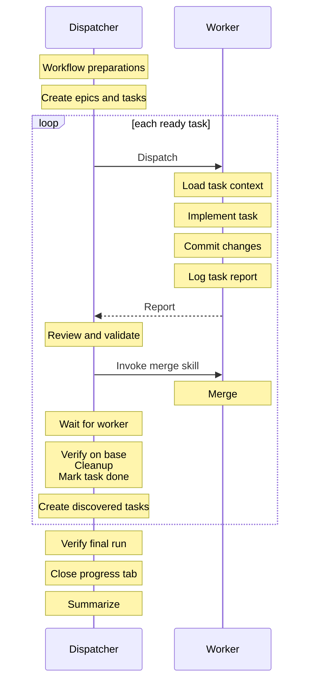

# Multi-Agent Task Workflow

```mermaid
sequenceDiagram
    participant Dispatcher
    participant Worker

    Note over Dispatcher: Workflow preparations
    Note over Dispatcher: Create epics and tasks
    loop each ready task
        Dispatcher->>Worker: Dispatch
        Note over Worker: Load task context
        Note over Worker: Implement task
        Note over Worker: Commit changes
        Note over Worker: Log task report
        Worker-->>Dispatcher: Report
        Note over Dispatcher: Review and validate
        Dispatcher->>Worker: Invoke merge skill
        Note over Worker: Merge
        Note over Dispatcher: Wait for worker
        Note over Dispatcher: Verify on base<br/>Cleanup<br/>Mark task done
        Note over Dispatcher: Create discovered tasks
    end
    Note over Dispatcher: Verify final run
    Note over Dispatcher: Close progress tab
    Note over Dispatcher: Summarize
```
