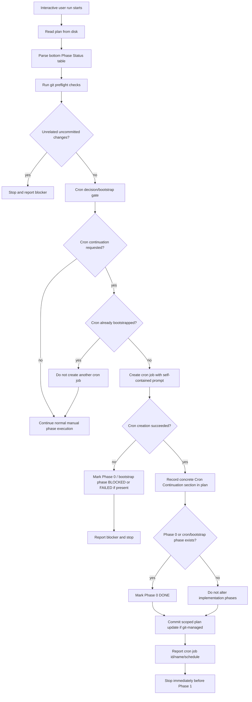

# Cron-driven Phase 0 Flow

Logic diagram for the cron-driven flow when executing the draft `git-managed-plan-execution` skill against a plan whose phase table starts with Phase 0.

## Interactive bootstrap flow



## Cron tick flow

```mermaid
flowchart TD
    A[Cron tick starts in fresh session] --> B[Read plan from disk]
    B --> C[Parse Phase Status table]
    C --> D[Parse Cron Continuation config]
    D --> E[Run git preflight checks]

    E --> E1{Required cron params missing?}
    E1 -- yes --> STOP1[Stop and report ambiguity]
    E1 -- no --> E2{Unrelated uncommitted changes?}

    E2 -- yes --> STOP2[Stop and report blocker]
    E2 -- no --> F{Phase 0 / bootstrap phase exists?}

    F -- yes --> G{Phase 0 is DONE?}
    G -- no --> STOP3[Stop: bootstrap incomplete; cron must not execute Phase 0]
    G -- yes --> H[Ignore Phase 0 for implementation selection]

    F -- no --> H

    H --> I{Execution mode?}

    I -- sequential --> S1{Any implementation phase IN PROGRESS?}
    S1 -- yes --> STOP4[Stop and report possible active runner]
    S1 -- no --> S2[Select first TODO implementation phase after Phase 0]

    I -- parallel --> P1[Select independent TODO implementation phase(s)]
    P1 --> P2{Ownership/dependencies explicit?}
    P2 -- no --> STOP5[Stop and report ambiguous ownership]
    P2 -- yes --> P3[Assign distinct branch/worktree per phase]

    S2 --> W{Eligible TODO phase found?}
    P3 --> W

    W -- yes --> X[Create/switch branch or worktree]
    X --> Y[Optionally mark selected phase IN PROGRESS]
    Y --> Z[Execute only scoped phase work]
    Z --> AA[Run local verification commands]

    AA --> AB{Verification passed?}
    AB -- no --> AC[Mark phase FAILED/BLOCKED/DEFERRED as appropriate]
    AC --> AD[Commit scoped status/report if appropriate]
    AD --> VERIFY[Run completion verifier]

    AB -- yes --> AE[Mark phase DONE]
    AE --> AF[Inspect git status and relevant diff]
    AF --> AG[Commit scoped implementation + phase status]
    AG --> AH[Verify clean git status]
    AH --> VERIFY[Run completion verifier]

    W -- no --> VERIFY

    VERIFY --> V1[Re-read plan]
    V1 --> V2[Parse Phase Status table]
    V2 --> V3[Run configured safe verification commands]
    V3 --> V4[Check git status --short]
    V4 --> V5{All accepted phases complete and verification passes?}

    V5 -- no --> R1[Leave cron active]
    R1 --> REPORT1[Report attempted phase, result, verification, commit, next action]

    V5 -- yes --> C1[List cron jobs]
    C1 --> C2[Identify only this continuation job by id/name]
    C2 --> C3{Configured self-stop action}
    C3 -- pause default --> C4[Pause this cron job]
    C3 -- remove explicit only --> C5[Remove this cron job]

    C4 --> REPORT2[Report complete and cron paused]
    C5 --> REPORT3[Report complete and cron removed]
```

## Key Phase 0 behavior

```text
Phase 0 is bootstrap state, not implementation work, when cron continuation is enabled.

Interactive run:
  - May create the cron job.
  - Records ## Cron Continuation.
  - Marks Phase 0 DONE if Phase 0 is the cron/bootstrap phase.
  - Commits the scoped plan update.
  - Stops immediately.
  - Must not start Phase 1 in the same run.

Cron run:
  - Must not create another cron job.
  - Must not execute Phase 0.
  - Requires Phase 0/bootstrap to already be DONE.
  - Starts with the first eligible TODO implementation phase after Phase 0.
  - Sequential mode executes at most one phase per tick.
  - At the end of each tick, runs the completion verifier.
  - If complete, pauses/removes only its own cron job.
```
